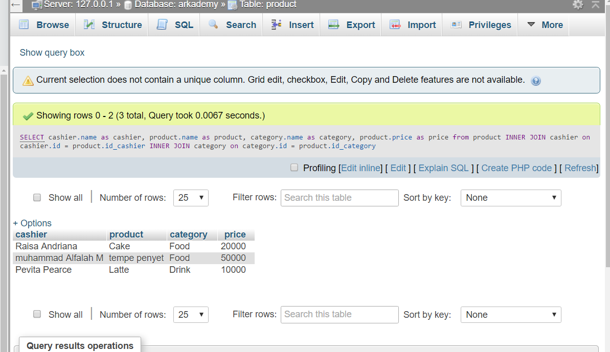
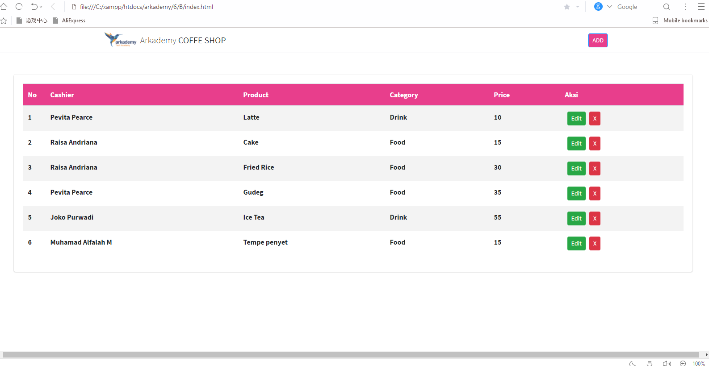
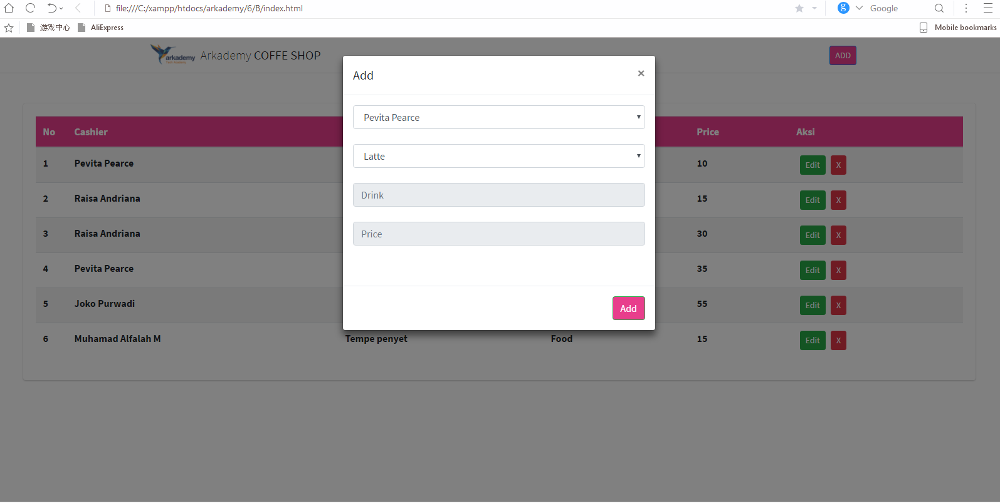
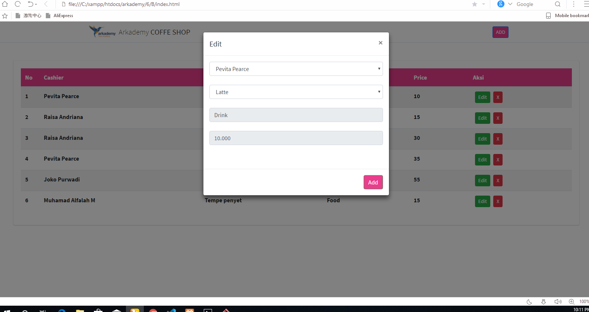
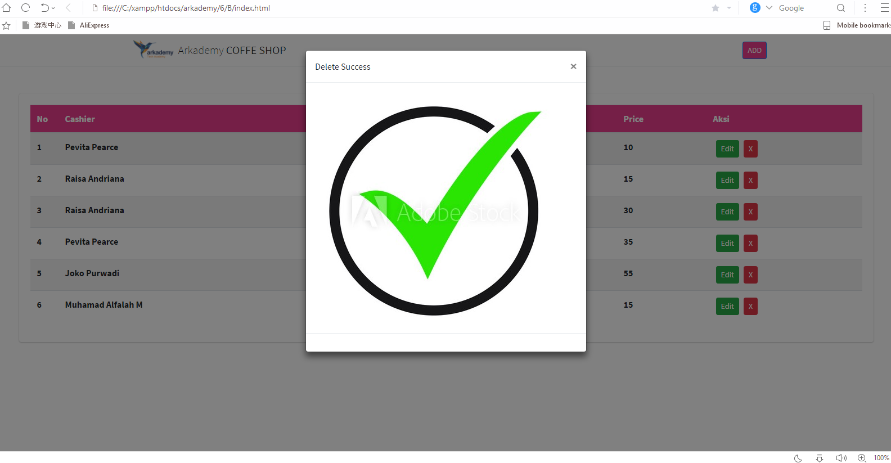

# Arkademy-B13K3
jawaban test ikut botcamp

jawaban 1-5 dapat di uji lewat https://www.onlinegdb.com/

# screenshoot no 6
1. database

2. tampilan 

#
untuk soal nomer 6.C saya kebingungan dalam mengerjakan crudnya, karena menurut saya harusnya ada satu tabel lagi yang bernama transaksi dimana data dari tabel transaksi inilah yang di gunakan untuk menampilkan data di tampilan. 

kebingungan saya juga hadir ketika melihat tampilan tambah/edit produk dimana field input product merupakan form select dan form category adalah form input . padahal di desain database form category merupakan form select

note : untuk apa menambah product kalau nama productnya adalah data dari product itu sendiri 
